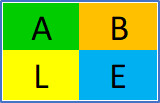

# STRUCTURE IN PRIME GAPS - FORMALIZED

## PROJECT PROPOSAL

## prepared for: \https://leanprover.zulipchat.com/

## prepared by: \KAJANI KAUNDA


```
import Mathlib.Data.Nat.Prime.Basic
import data.set.basic
import algebra.group.defs

open int

-- Define the set of all primes (ℤ is used to include additive inverses)
def is_prime (z : ℤ) : Prop := nat.prime z.nat_abs

-- Define the Cayley table T as a function from pairs of primes and their inverses to ℤ
def T (p q : ℤ) (hp : is_prime p) (hq : is_prime q) : ℤ :=
  if (0 < p ∧ 0 < q) then p + (-q) else 0

-- Example usage: proving that T respects commutativity in the prime groupoid
example (p q : ℤ) (hp : is_prime p) (hq : is_prime q) : T p q hp hq = T q p hq hp :=

begin
    unfold T,
    split_ifs,
    { simp [add_comm] },
    { refl },
End
```

# **Structure in Prime Gaps -- Formalized**

## **By Kajani Kaunda, , , , , \... .**

## **Abstract**

In this open community project, we formalize using the LEAN programming
language, the definitions and results presented in the paper [*Structure
in Prime
Gaps*](https://www.researchsquare.com/article/rs-4058806/latest).

## **Introduction**

**Remark:** *In this paper, we will dispense with a lot of contextual
explanations and restrict ourselves only to those which are pertinent to
the formalization process.*

Formalization of Mathematics.

The formalization of mathematics refers to the process of encoding
mathematical definitions, theorems, and proofs in a formal language that
can be processed and checked for correctness by a computer. This
approach ensures that every logical step is explicitly verified, leaving
no room for ambiguity or human error. This meticulous approach ensures
that every logical step is explicitly defined and verified, minimizing
the risk of human error in mathematical proofs. The goal is to achieve a
level of rigor and precision that surpasses traditional mathematical
methods, enabling the verification of complex proofs and the discovery
of new mathematical insights. Formalization not only helps in validating
existing results but also provides a robust framework for discovering
new ones.

Proof Assistants.

Proof assistants are software tools designed to aid in the creation and
verification of formal proofs. These tools provide a platform for
writing proofs in a formal language and automatically verifying their
correctness. They offer a rigorous environment where users can construct
proofs interactively or automatically, depending on the complexity of
the problem. These tools are essential in modern mathematics and
computer science, allowing for the development of highly reliable
software and the verification of intricate mathematical theorems.
Popular proof assistants include Coq, Isabelle, and Lean. There are many
others. They are used not only in pure mathematics but also in fields
like computer science, where formal verification of software and
hardware is crucial. They have been instrumental in formalizing
significant results across various domains.

LEAN.

LEAN is a modern open-source proof assistant developed at Microsoft
Research. It stands out for its user-friendly interface and powerful
capabilities in both theorem proving and automated reasoning. It is
designed to support the formalization of mathematics and the
verification of software. LEAN supports a rich type theory known as
dependent type theory, which allows for expressive and concise
representations of mathematical objects and proofs. Its growing
ecosystem includes a standard library of formalized mathematics and
tools like the LEAN community web editor. LEAN has been adopted by many
mathematicians and computer scientists for both educational purposes and
advanced research projects. LEAN combines powerful automation with
interactive proof development, making it accessible to both beginners
and experts. LEAN 4, the latest version, offers significant improvements
in performance and usability, encouraging more widespread adoption
within the mathematical community.

Structure in Prime Gaps.

In this paper, we aim to formalize the results presented in the article
*Structure in Prime Gaps* using LEAN4, the latest version of the LEAN
proof assistant. By leveraging the capabilities of LEAN4, we seek to
ensure the correctness and robustness of these findings relating to the
existence of infinitely many pairs of prime numbers with specific gaps.
This formalization will provide a rigorous foundation for the results
and contribute to the broader effort of formalizing mathematics.

The paper [*Structure in Prime
Gaps*](https://www.researchsquare.com/article/rs-4058806/latest)
presents two main results the first of which is the claim that there
exist structured gaps between primes and the second result is basically
a corollary or special case of the first. These are stated as follows:

> **Theorem 1**: For every prime *p*<sub>α</sub>, there exists infinitely many
> pairs of primes, (*p*<sub>n</sub>, *p*<sub>n+m</sub>), such that (*p*<sub>n+m</sub> − *p*<sub>n</sub>) =
> *p*<sub>α</sub> − 3, where *n*, *α* ≥ 3, *m* ≥ 1, and *p*<sub>n</sub> is the *n*<sup>th</sup>
> prime.

> **Theorem 2**: There exist infinitely many pairs of primes with a gap of 2.

## A brief visual overview of the results presented in the article *Structure in Prime Gaps*

The following partial Cayley table *T* represents gaps between primes in
which the results we are formalizing are visually *self-evident*.

Consider Table 1, it is not immediately apparent if any useful pattern
can be discerned from it. However, with the highlights in Table 2, a
compelling *pattern* emerges, one that leads directly to **Theorem 1**
from which **Theorem 2** is implied as seen in Table 3.

-   Each pattern is defined and identified by the 4-tuple *β =* (*A, B,
    L, E*) formed from the elements in the vertices of a sub-array
    *T*<sub>i</sub> of *T*. In Table 2, the first 4-tuple *β =* (*A, B, L, E*)
    for prime 23 is *β =* (20, 28, 12, 20).

-   Every sub-array *TT*<sub>i</sub>, defines two pairs of primes. In Table 2,
    the *First pair* is (3, *p*<sub>α</sub>) or (3, 23) and the *Second pair* is
    (((*B* + 3) + 0 -- *E*), (*B* + 3)) or (11, 31). We can denote the
    integers 11 and 31 in the *Second pair* using the variables *Q*<sub>i</sub>
    and *R*<sub>i</sub> respectively.

-   The *First pair* remains constant for all patterns related to any
    prime *p*<sub>α</sub> ≥ 5. Subsequent *Second pairs* are unique for each
    sub-array *TT*<sub>i</sub> of *T*.

-   *L* is always congruent to 0 mod 6.

**Legend for Tables:**

-   **Table 1:** Represents the Cayley Table *T* of the *Commutative
    Partial Groupoid* structure (*J*, +) without immediately discernible
    patterns highlighted.

-   **Table 2:** Highlights patterns where the 4-tuple *β* = (*A, B, L,
    E*) defines each pattern, with specific examples provided. The
    "Pattern" here is more elaborately defined in the sense that it
    consists of integers other than just *Q*<sub>i</sub> and *R*<sub>i</sub>.

-   **Table 3:** Demonstrates the implication of results derived from
    the patterns observed in Table 2.

-   **Remark:** We note that the Cayley Table *T* is a partial
    representation of an otherwise infinite structure. Therefore no
    generalization of these results to some "complete/larger" set is
    required.

**Table 1**


**Table Legend**



**Table 2**


**Table 3**


**Formalization Strategy**

We design the Formalization Process section of this document as follows.
For each item to be formalized, we will;

-   **Item name** : Name the item to be formalized.

-   **Formal statement** : Formally state the item to be formalized.

-   **Note** : Provide explanation notes.

-   **LEAN4 code** : Provide the LEAN4 code.

-   **Annotation** : Provide annotation of the LEAN4 code.

This way, all the resources *necessary* to re-produce the results of the
process are in one document.

**Deliverables**

In addition to this document, we also provide the following:

-   **Blueprint**: a blueprint document of the formalization.

-   **Documentation**: documentation of the formalization.

-   **Source Paper**: a link to the paper Structure in Prime Gaps.

-   **Formalization Repository**: a link to a GitHub repository of the
    formalization.

-   **Website**: We will host it using the simple and free "Github
    Pages" facility.

-   [**ArXiv e-print Archive Document**](https://arxiv.org/): A LaTeX
    document of the formalization results.

**The Formalization Process**

We begin as follows:

**Item name**

Definition 1.

**Formal statement**

**Definition 1**: Define a model of prime gaps as a Cayley Table *T*
constructed from a *Cummutative Partial Groupoid* (*J*, +) based on a
subset *J* of *Z* containing the infinite set of prime numbers and their
additive inverses, such that the elements of the first row of *T* are
the primes and the elements of the first column of *T* are their
additive inverses.

**Notes**

The set *J* is defined as follows *J* = (\...,−*p*<sub>n+2</sub>, −*p*<sub>n+1</sub>,
−*p*<sub>n</sub>, *p*<sub>n</sub>, p<sub>n+1</sub>, *p*<sub>n+2</sub>, \...). Notice that since primes are
infinite then by definition the structure T is also infinite. Ideally,
the proof structures used by LEAN4 must reflect this property rather
than relying on the proof not depending on this property being
represented in the proof structures since there is no empirical analysis
of the prime involved.

**LEAN4 code**

```
import Mathlib.Data.Nat.Prime.Basic
import data.set.basic
import algebra.group.defs

open int

-- Define the set of all primes (ℤ is used to include additive inverses)
def is_prime (z : ℤ) : Prop := nat.prime z.nat_abs

-- Define the Cayley table T as a function from pairs of primes and their inverses to ℤ
def T (p q : ℤ) (hp : is_prime p) (hq : is_prime q) : ℤ :=
  if (0 < p ∧ 0 < q) then p + (-q) else 0

-- Example usage: proving that T respects commutativity in the prime groupoid
example (p q : ℤ) (hp : is_prime p) (hq : is_prime q) : T p q hp hq = T q p hq hp :=

begin
    unfold T,
    split_ifs,
    { simp [add_comm] },
    { refl },
End
```

**LEAN4 code annotation**

  -----------------------------------------------------------------------

  -----------------------------------------------------------------------
**Item name**

Definition 2.

**Formal statement**

> **Definition 2**: Define a *v* x *w* sub-array *TT*~i~ of *T* such that *v, w* ≥ 2.

**Notes**

Definition 2 defines a sub-array which is later used to algebraically
construct a pattern.

> Example: *TT*<sub>1</sub> = ((2, 4, 8, 10), (0, 2, 6, 8), (-2, 0, 4, 6), (-6, -4, 0, 2)).

**LEAN4 code**

  -----------------------------------------------------------------------

  -----------------------------------------------------------------------

**LEAN4 code annotation**

  -----------------------------------------------------------------------

  -----------------------------------------------------------------------

**Item name**

Definition 3.

**Formal statement**

**Definition 3**: Define a 4-tuple *β* = (*A, B, L, E*) such that the
values of the elements are the vertices of *TT*~i~.

**Notes**

This is one of the structures used in the analysis of *T*.

Example: for *TT*~1~, we have *TT*~1~. *β* = (2, 10, -6, 2).

**LEAN4 code**

  -----------------------------------------------------------------------

  -----------------------------------------------------------------------

**LEAN4 code annotation**

  -----------------------------------------------------------------------

  -----------------------------------------------------------------------

### Explanation

**Item name**

Lemma 4.1. This is the first Lemma.

**Formal statement**

**Lemma 4.1** : Prove that: Given a 4-tuple *β* then *A* + *E* = *B* +
*L*.

**Notes**

This is one of the results used in the subsequent proofs.

The proof is derived from the construction of *T*.

**LEAN4 code**

  -----------------------------------------------------------------------

  -----------------------------------------------------------------------

**LEAN4 code annotation**

  -----------------------------------------------------------------------

  -----------------------------------------------------------------------

### Explanation

**Item name**

Lemma 4.2. This is the second Lemma.

**Formal statement**

**Lema 4.2** : Prove that: All prime numbers greater than 3 can be
expressed in the form 6n + 1

> or 6n − 1.
>
> (A known result).

**Notes**

This result is used in the subsequent proofs.

**LEAN4 code**

  -----------------------------------------------------------------------

  -----------------------------------------------------------------------

**LEAN4 code annotation**

  -----------------------------------------------------------------------

  -----------------------------------------------------------------------

**Item name**

Lemma 4.3. this is the third Lemma.

**Formal statement**

**Lemma 4.3**: Let *t*<sub>m,n</sub> be a term in *T* where the indexes *m* and
*n* are zero based and refer to the rows and columns in *T*
respectively.

> Prove that:
>
> For every prime *p*~α~ ≥ 5, there exists a sub-array *TT*~i~ ∈ *T*
> such that the following properties are simultaneously true;
>
> Property 1 : *TT*~i~.*A* + 3 ∈ {6*n* ± 1\|*n* ∈ *N*~1~}
>
> Property 2 : (*TT*~i~.*B* + 3) − *TT*~i~.*E* ∈ {6*n* ± 1\|*n* ∈
> *N*~1~}
>
> Property 3 : *TT*~i~.*L* ≡ 0 (mod 6)
>
> Property 4 : *TT*~i~.*A* = *TT*~i~.*E*
>
> Property 5 : *TT*~i~.*B* + 3 ∈ {6*n* ± 1\|*n* ∈ *N*~1~}
>
> If and only if
>
> for *TT*~i~.*A* + 3 ∈ {6*n* − 1\|*n* ∈ *N*~1~};
>
> *TT*~i~.*A* = 6*x* + 6*y* − 4
>
> *TT*~i~.*B* = 6*x* + 12*y* − 8
>
> *TT*~i~.*L* = 6*x*
>
> *TT*~i~.*E* = 6*x* + 6*y* − 4
>
> for *TT*~i~.*A* + 3 ∈ {6*n* + 1\|*n* ∈ *N*~1~};
>
> *TT*~i~.*A* = 6*x* + 6*y* − 2
>
> *TT*~i~.*B* = 6*x* + 12*y* − 4
>
> *TT*~i~.*L* = 6*x*
>
> *TT*~i~.*E* = 6*x* + 6*y* − 2
>
> where *n* ∈ *N*~1~, *x* \< *n*, *y* \> 0, *n* = *x* + *y*,
> (*TT*~i~.*A* + 3) = *p*~α~ and *TT*~i~.*A* = *t*~2,k~.

**Notes**

This result demonstrates the existence of a pattern. It algebraically
shows that for every prime *p*~α~ ≥ 5, there is a pattern *TT*~i~ that
defines a pair of integers *Q*~i~ and *R*~i~ such that *R*~i~ − *Q*~i~ =
*p*~α~ − 3.

The key in the proof of this result is the following analysis:

-   We are given *p*~α~ as a constant quantity.

-   Now *p*~α~ can be expressed in the form 6*n* ± 1.

-   This implies that *n* in the expression 6*n* ± 1 is constant.

-   We then let *n* = *x* + *y*.

-   We then use combinatory analysis to heuristically determine which
    expressions to assign to *A*, *B*, *L* and *E* from the sets *M* =
    (6*x*, 6*y*, -4, 6*x*, 6*y*, -4) and *N* = (6*x*, 6*y*, -2, 6*x*,
    6*y*, -2) such that the five (5) properties of Lemma 4.3 are
    satisfied.

But how are the sets *M* and *N* derived?

Notice that by Lemma 4.3, *TT*~i~.*A* = *TT*~i~.*E* and (*TT*~i~.*A* +
3) = *p*~α~. Since *p*~α~ is prime then it can be expressed in the forms
6*n* ± 1 or 6(*x* + *y*) ± 1. And by Lemma 4.1, *A* + E = *B* + *L*,
which implies that *TT*~i~.*B* + *TT*~i~.*L* = *TT*~i~.*A* + *TT*~i~.E =
((6*x +* 6*y* + -4) + (6*x +* 6*y +* -4)) or ((6*x +* 6*y +* -2) + (6*x
+* 6*y +* -2)) depending on which form *p*~α~ can be expressed.

**LEAN4 code**

  -----------------------------------------------------------------------

  -----------------------------------------------------------------------

**LEAN4 code annotation**

  -----------------------------------------------------------------------

  -----------------------------------------------------------------------

### Explanation

**Item name**

Lemma 4.4. This is the fourth Lemma.

**Formal statement**

**Lemma 4.4**: Let any sub-array *TT*~i~ that satisfies Lemma 4.3 be
referred to as a *Prime Array*.

> Prove that: For every prime *p*~α~ ≥ 5, there are infinitely many
> *Prime Arrays* such that *TT~i~.A = p*~α~ *− 3.*

**Notes**

This will show that for any prime *p*~α~ ≥ 5 the pattern defined by the
*Prime Array TT*~i~ occurs infinitely often and that consequently, the
integer pairs (*Q*~i~, *R*~i~) also occur infinitely often.

The key in the proof is to show that for any prime *p*~α~ ≥ 5,

-   *p*~α~ is constant.

-   Which implies *n* is constant.

-   But *n* = *x* + *y*

-   Now changing the value of *y* changes the value of *x in order* to
    maintain the equality *n* = *x* + *y*.

-   Changing the value of *x* changes the value of *L* since *L* = 6*x*.

-   Changing the value of *L* changes the value of *B* since *B* + *L* =
    *A* + *E* and *A* + *E* is a constant expression.

-   This implies that the value of *y* can be changed infinitely often
    and each change represents a different sub-array or *Prime Array*
    *TT*~i~.

**LEAN4 code**

  -----------------------------------------------------------------------

  -----------------------------------------------------------------------

**LEAN4 code annotation**

  -----------------------------------------------------------------------

  -----------------------------------------------------------------------

**Item name**

Lemma 4.5. This is the fifth Lemma.

**Formal statement**

**Lemma 4.5**: Prove that: For every prime *p*~α~ ≥ 5, there exists
infinitely many *Prime Arrays*, *TT*~i~, such that *TT*~i~ .*A* = *p*~α~
− 3 and (*T*~i~.*B* + 3) and ((*T*~i~.*B* + 3) −*T*~i~.*E*) are prime.

**Notes**

This will show that for any prime *p*~α~ ≥ 5, the *Prime Arrays* *TT*~i~
occur infinitely often and *Q*~i~ and *R*~i~ are prime. Notice that
here, (*TT*~i~.*B* + 3) = *R*~i~ and *Q*~i~ = ((*TT*~i~.*B* + 3) −
*TT*~i~.*E*).

The proof here relies on the construction of *T* where all the elements
on the first row of *T* are prime

We can then algebraically show that (*TT*~i~.*B* + 3) and
((*TT*~i~.*B* + 3) − *TT*~i~.*E*) are prime.

**LEAN4 code**

  -----------------------------------------------------------------------

  -----------------------------------------------------------------------

**LEAN4 code annotation**

  -----------------------------------------------------------------------

  -----------------------------------------------------------------------

**Item name**

Theorem 1. The first Theorem, the first of the two main results.

**Formal statement**

**Theorem 1**: Prove that: For every prime *p*~α~, there exists
infinitely many pairs of primes, (*p*~n~, *p*~n+m~), such that (*p*~n+m~
− *p*~n~) = *p*~α~ − 3, where n, α ≥ 3, m ≥ 1, and *p*~n~ is the n^th^
prime.

**Notes**

The claim is that this result is implied from the previous results as
demonstrated in the following steps:

**Step 1**: By Lemma 4.5, and the construction of *T*, *TT*~i~.*A* and
*TT*~i~.*E* are prime gaps.

**Step 2**: By Lemma 4.3, *TT*~i~.*A* = *TT*~i~*.E*.

This is equivalent to: (*TT*~i~.*A* + 3) − 3 = ((*TT*~i~.*B* + 3) −
((*TT*~i~.*B* + 3) − *TT*~i~.*E*)).

**Step 3**: By Lemma 4.5, the following are prime; (*TT*~i~.*A* + 3),
((*TT*~i~.*B* + 3) − *TT*~i~.*E*), (*TT*~i~.*B* + 3).

**Step 4**: By Lemma 4.5, for every prime (*TT*~i~.*A* + 3) ≥ 5, there
are infinitely many of the following pairs of primes defined as:
(((*TT*~i~.*B* + 3) − *TT*~i~.*E*), (*TT*~i~.*B* + 3)).

We can then see that the following statement is implied:

> For every prime (*TT*~i~.*A* + 3) ≥ 5, there exists infinitely many
> pairs of primes, (((*TT*~i~.*B* + 3) − *TT*~i~.*E*), (*TT*~i~.*B* +
> 3)), such that ((*TT*~i~.*B* + 3) − ((*TT*~i~.*B* + 3) − *TT*~i~.*E*))
> = (*TT*~i~.*A* + 3) − 3.

This statement is equivalent to the formal statement of Theorem 1 which
can be is re-stated using the following equivalent assignments:

> *p*~α~ − 3 = *TT*~i~.*A*.
>
> *p*~n+m~ − 3 = *TT*~i~.*B.*
>
> *p*~α~ − *p*~n~ = *TT*~i~.*L*.
>
> *p*~n+m~ − *p*~n~ = *TT*~i~.*E.*

**LEAN4 code**

  -----------------------------------------------------------------------

  -----------------------------------------------------------------------

**LEAN4 code annotation**

  -----------------------------------------------------------------------

  -----------------------------------------------------------------------

**Item name**

Theorem 2. This is the second Theorem, the second of the two main
results.

**Formal statement**

**Theorem 2**: Prove that there exist infinitely many pairs of primes
with a gap of 2.

**Notes**

This result is just a special case of Theorem 1 when *p*~α~ is set to 5.
I am sure this would be resolved by LEAN4 using the \"refl\" similar
tactic.

**LEAN4 code**

  -----------------------------------------------------------------------

  -----------------------------------------------------------------------

**LEAN4 code annotation**

  -----------------------------------------------------------------------

  -----------------------------------------------------------------------

**Outcome and Conclusion**

By formalizing the results presented in the paper [*Structure in Prime
Gaps*](https://www.researchsquare.com/article/rs-4058806/latest), we
hope to contribute to the body of knowledge in mathematics as well as
help establish the use of proof assistants like LEAN in academia,
research and industry in general.

**Source References**

\[1\] Kaunda, K: [*Structure in Prime
Gaps*](https://www.researchsquare.com/article/rs-4058806/latest),
(2024).

\[2\] Monticone, P: Lean 4 Project Template for blueprint-driven
formalization projects, https://pitmonticone.github.io/LeanProject/.

\[3\] Patrick Massot: A plasTeX plugin allowing to write blueprints for
Lean 4 projects.

\[4\] LEANPROVER ZULIP CHAT Community:
https://leanprover.zulipchat.com/.
