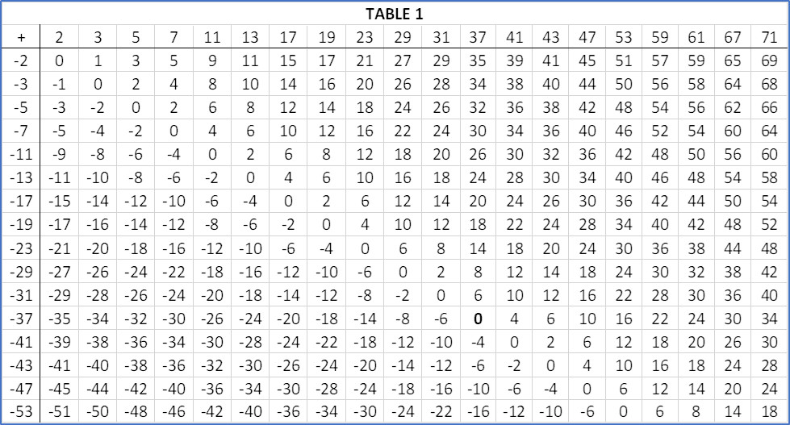

# STRUCTURE IN PRIME GAPS - FORMALIZED

## prepared for: https://leanprover.zulipchat.com/

## prepared by: KAJANI KAUNDA


Let us lean together!


```
import Mathlib

set_option linter.unusedTactic false 
set_option linter.unusedVariables false 

-- ------------------------------------------------------
-- define the cayley table - infinitely defined
-- ------------------------------------------------------

def primes_set := { n | Nat.Prime n }

instance : Infinite primes_set := Nat.infinite_setOf_prime.to_subtype
instance : DecidablePred (fun n => n ∈ primes_set) := 
fun n => Nat.decidablePrime n

def primes (n : ℕ) : ℕ := if (n = 0) then 0 else Nat.Subtype.ofNat primes_set (n - 1)

lemma primes_zero : primes 0 = 0 := rfl

def primes_inv_exists (n : ℕ) (n_prime : Nat.Prime n) : ∃ i, primes i = n :=
by
  have := Nat.Subtype.ofNat_surjective (s := primes_set)
  obtain ⟨a, ha⟩ := this ⟨n, n_prime⟩
  use a + 1
  simp [primes, ha]

def primes_inv (n : ℕ) (n_prime : Nat.Prime n) : ℕ := Nat.find (primes_inv_exists n n_prime)
def primes_inv_def (n : ℕ) (n_prime : Nat.Prime n) : primes (primes_inv n n_prime) = n :=
Nat.find_spec (primes_inv_exists n n_prime)

lemma primes_inv_pos (n : ℕ) (n_prime : Nat.Prime n) : 0 < primes_inv n n_prime :=
by
  rw [zero_lt_iff]
  intro h
  replace h := congrArg primes h
  rw [primes_inv_def, primes_zero] at h
  exact n_prime.ne_zero h

lemma primes_prime {n : ℕ} (hn : n > 0) : Nat.Prime (primes n) :=
by
  unfold primes
  rw [if_neg hn.ne']
  exact Subtype.mem _

def cayley_table (row col : ℕ) : ℤ := primes col - primes row

```

# **Structure in Prime Gaps - Formalized**

## **By Kajani Kaunda.**

## Structure in Prime Gaps

This project formalizes a result from the article [*Structure in Prime Gaps*](https://www.researchsquare.com/article/rs-4058806/latest) using Lean 4, the latest version of the LEAN proof assistant. By utilizing Lean 4's robust proof-checking mechanisms, we ensure the correctness and rigor of the findings related to the existence of infinitely many structured gaps between prime numbers. 

This formalization contributes to the growing body of work aimed at formalizing mathematical proofs.

The paper [*Structure in Prime Gaps*](https://www.researchsquare.com/article/rs-4058806/latest) presents two key results:

> 1. **Theorem 1**: For every prime *p*<sub>α</sub>, there exists infinitely many
> pairs of primes, (*p*<sub>n</sub>, *p*<sub>n+m</sub>), such that (*p*<sub>n+m</sub> − *p*<sub>n</sub>) =
> *p*<sub>α</sub> − 3, where *n*, *α* ≥ 3, *m* ≥ 1, and *p*<sub>n</sub> is the *n*<sup>th</sup>
> prime.

> 2. **Theorem 2**: There exist infinitely many pairs of primes with a gap of 2.

This repository contains the formalization of **Theorem 1** in Lean 4. **Theorem 2**, which asserts the existence of infinitely many pairs of primes with a gap of 2, follows directly as a corollary of **Theorem 1** when p<sub>α</sub> is set to 5.

## A brief visual overview of the results presented in the article *Structure in Prime Gaps*

The following partial Cayley table *T* represents gaps between primes in
which the results we are formalizing are *self-evident*.

Consider Table 1, it is not immediately apparent if any useful pattern
can be discerned from it. However, with the highlights in Table 2, a
compelling *pattern* emerges, one that leads directly to **Theorem 1**
from which **Theorem 2** is implied as seen in Table 3.

-   Each pattern is defined and identified by the 4-tuple *β =* (*A, B,
    L, E*) formed from the elements in the vertices of a sub-array
    *T*<sub>i</sub> of *T*. In Table 2, the first 4-tuple *β =* (*A, B, L, E*)
    for prime 23 is *β =* (20, 28, 12, 20).

-   Every sub-array *TT*<sub>i</sub>, defines two pairs of primes. In Table 2,
    the *First pair* is (3, *p*<sub>α</sub>) or (3, 23) and the *Second pair* is
    (((*B* + 3) + 0 - *E*), (*B* + 3)) or (11, 31). We can denote the
    integers 11 and 31 in the *Second pair* using the variables *Q*<sub>i</sub>
    and *R*<sub>i</sub> respectively.

-   The *First pair* remains constant for all patterns related to any
    prime *p*<sub>α</sub> ≥ 5. Subsequent *Second pairs* are unique for each
    sub-array *TT*<sub>i</sub> of *T*.

-   *L* is always congruent to 0 mod 6.

**Legend for Tables:**

-   **Table 1:** Represents the Cayley Table *T* of the *Commutative
    Partial Groupoid* structure (*J*, +) without immediately discernible
    patterns highlighted.

-   **Table 2:** Highlights patterns where the 4-tuple *β* = (*A, B, L,
    E*) defines each pattern, with specific examples provided. The
    "Pattern" here is more elaborately defined in the sense that it
    consists of integers other than just *Q*<sub>i</sub> and *R*<sub>i</sub>.

-   **Table 3:** Demonstrates the implication of results derived from
    the patterns observed in Table 2.

-   **Remark:** We note that the Cayley Table *T* is a partial
    representation of an otherwise infinite structure. 

**Table 1**



**Table Legend**


**Table 2**


**Table 3**


  -----------------------------------------------------------------------

**Conclusion**

By formalizing these results, we hope to contribute to the body of 
knowledge in mathematics as well as help establish the use of proof 
assistants like LEAN in academia, research and industry in general.

## Implication for the Twin Prime Conjecture

The formalization in Lean 4 establishes that for any fixed prime `P' > 3`, the subtype

```
{b : Beta // b.P = P'}
```

is infinite. This means that for every such prime `P'`, there are infinitely many distinct values of

```
b : Beta
```

with fixed `P = P'`, and each such `b` encodes a structured 4-tuple `(A, B, L, E)` satisfying

```
(B + 3) - ((B + 3) - E) = (A + 3) - 3 = P' - 3.
```

In particular, when we set `P' = 5`, the structured difference becomes `2`, and the above expression reduces to:

```
E = 2
```

This gives rise to infinitely many prime pairs of the form:

```
(B + 1, B + 3)
```

which is just `(p, p + 2)`—the standard twin prime form.

### Therefore:

> **The formalization of Theorem 1 in Lean 4 directly implies the twin prime conjecture** as a corollary by specializing to the case `P' = 5`.

This allows us to assert that the present work also constitutes a formalization, within Lean 4, of the **Twin Prime Conjecture**.

## Code & Build Instructions

### Method A: Using the Lean 4 Web Playground

1. Visit [https://live.lean-lang.org/](https://live.lean-lang.org/)
2. Paste the contents of `Project.lean` into the editor
3. Refresh the page to type-check the Lean code.

### Method B: Local Build with Lake

To build and run the project locally, use the following commands:

```
git clone https://github.com/kkaunda/spgf.git  
cd spgf  
lake env lean Project.lean
```

This will download Mathlib4 (if necessary), compile, and type‑check the file.

### Method C: Manual Execution with Lean CLI

If one already has Lean 4 and Mathlib4 installed, simply run:

```
lake env lean Project.lean
```

**Source References**

**Useful Links**

* [Zulip chat for Lean](https://leanprover.zulipchat.com/) for coordination
* [Discussion of the formalization project](https://leanprover.zulipchat.com/#narrow/channel/113488-general/topic/discussion.3A.20Structure.20in.20Prime.20Gaps.20-.20Formalized.20.28SPGF.29)
* [Blueprint](https://kkaunda.github.io/spgf/blueprint/)
* [Blueprint as pdf](https://kkaunda.github.io/spgf/blueprint.pdf)
* [Dependency graph](https://kkaunda.github.io/spgf/blueprint/dep_graph_document.html)
* [Doc pages for this repository](https://kkaunda.github.io/spgf/docs/)
* Kaunda, K: [*Structure in Prime Gaps*](https://www.researchsquare.com/article/rs-4058806/latest), (2024). (Pre-print).
* Pietro Monticone: [*Lean Project Template*](https://pitmonticone.github.io/LeanProject/) for blueprint-driven formalization projects.
* Patrick Massot: [*LeanBlueprint*](https://github.com/PatrickMassot/leanblueprint/), A plasTeX plugin allowing to write blueprints for Lean 4 projects.
